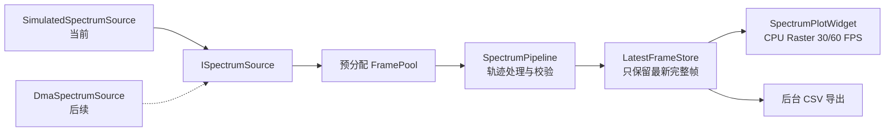

# RFSoC ZU47DR 实时频谱分析仪上位机

本项目是在 RFSoC ZU47DR PS 端 Linux 中运行的实时频谱显示软件。PL 端负责 DDC、FFT 和后续 AXI DMA 输出，PS 软件负责接收完整频谱帧、轨迹处理、测量与显示。

当前 PL/DMA 尚未完成，因此现阶段使用高帧率模拟数据源开发和验证。后续 `DmaSpectrumSource` 只需实现 `ISpectrumSource` 数据源契约并向统一管线发布 `SpectrumFrame`，频谱绘图、轨迹和导出模块无需重写。

## 当前功能

- Qt Widgets、C++17、CMake，兼容 Qt 6.x 和 Qt 5.15.x 源码接口；
- 完全基于 CPU Raster `QPainter`，不依赖 GPU、OpenGL、Qt Quick 或 `QOpenGLWidget`；
- 1,024～65,536 个频点；
- 噪声、两个可配置频率/幅度/带宽的固定信号、可配置起止/方向的扫频和带持续时间的随机瞬态模拟；
- 受限帧率和无等待压测模式，固定随机种子可重复；
- 可重复的数据暂停、序号跳变、异常帧和周期突发故障注入；
- 带版本、类型、范围和数组上限校验的 JSON 模拟场景加载与原子保存；
- Center、Span、参考电平和底部电平设置；
- Clear/Write、Average、Max Hold、Min Hold；
- M1～M4、Delta、Peak/Next/Previous、门限和完整频点区间峰值/信道功率；
- 鼠标选点、滚轮缩放、拖动平移、Shift 框选以及触摸 Pinch/Pan；
- 曲线颜色、线宽、网格和深浅绘图区主题；
- 开始、暂停、继续、停止和单次采集；
- 全屏显示，`Esc` 退出全屏；
- 输入/显示 FPS、平均数据率、丢帧、处理/绘制耗时、帧龄和显示延迟 P95；
- PNG 截图；
- 后台异步导出完整频谱 CSV，使用原子文件提交；
- 自动保存和恢复窗口、频率、幅度和轨迹配置；
- UTC 结构化滚动日志，可配置级别、单文件大小和保留数量；
- 采集工作线程异常隔离，可停止并重新启动；
- Qt Test 单元、集成、离屏渲染、导出和性能测试。

## 运行架构



采集线程和 GUI 刷新解耦。输入快于屏幕刷新时不积压待绘制队列，GUI 每次只读取最新完整帧。测量和 CSV 使用完整频点；绘制把频点压缩为每个屏幕列的最小/最大包络，因此窄带峰值不会因抽点消失。

## Windows Qt 6 开发

### 依赖

- Qt 6.x：Core、Gui、Widgets、Concurrent、Test；
- CMake 3.21 或更高；
- Ninja；
- 支持 C++17 的 MinGW-w64 或 MSVC。

本机已验证工具链为 Qt 6.10.2 + MinGW 13.1 + CMake + Ninja。示例命令：

```powershell
$env:Path = 'D:\Applications\Qt\Tools\mingw1310_64\bin;D:\Applications\Qt\6.10.2\mingw_64\bin;' + $env:Path

& 'D:\Applications\Qt\Tools\CMake_64\bin\cmake.exe' `
  -S . -B build\win-qt6-release -G Ninja `
  -DCMAKE_BUILD_TYPE=Release `
  -DCMAKE_MAKE_PROGRAM='D:\Applications\Qt\Tools\Ninja\ninja.exe' `
  -DCMAKE_CXX_COMPILER='D:\Applications\Qt\Tools\mingw1310_64\bin\g++.exe' `
  -DCMAKE_PREFIX_PATH='D:\Applications\Qt\6.10.2\mingw_64'

& 'D:\Applications\Qt\Tools\CMake_64\bin\cmake.exe' --build build\win-qt6-release --parallel
& 'D:\Applications\Qt\Tools\CMake_64\bin\ctest.exe' --test-dir build\win-qt6-release --output-on-failure
& 'D:\Applications\Qt\Tools\CMake_64\bin\cmake.exe' --install build\win-qt6-release `
  --prefix build\install-final
```

Windows 安装步骤会自动调用 Qt 的 `windeployqt`，把 Qt DLL、MinGW/MSVC 运行库和
`platforms/qwindows.dll` 部署到安装目录。可直接双击的程序为
`build\install-final\bin\rtsa_app.exe`。交付或移动时必须保留整个
`build\install-final` 目录结构，不能只复制单独的 `rtsa_app.exe`。

运行：

```powershell
build\win-qt6-release\src\rtsa_app.exe
build\win-qt6-release\src\rtsa_app.exe --source simulated --fullscreen
build\win-qt6-release\src\rtsa_app.exe --source simulated `
  --scenario config\default-simulation.json
build\win-qt6-release\src\rtsa_app.exe --source simulated `
  --scenario config\unthrottled-stress.json --smoke-test-ms 3000
build\win-qt6-release\src\rtsa_app.exe --source simulated `
  --scenario config\fault-injection.json --smoke-test-ms 3000
build\win-qt6-release\src\rtsa_app.exe --log-level info `
  --log-max-bytes 5242880 --log-retained-files 3
```

`--smoke-test-ms` 会自动开始采集并在指定时间后正常退出，且不会读写用户配置，适合 CI 和稳定性测试。
`--source` 接受 `simulated` 或 `dma`；真实 DMA 协议尚未冻结时选择 `dma` 会明确报错，不会静默回退。完整参数见 `--help` 和《实时频谱分析仪软件用户操作说明》。“WrapVulkanHeaders 缺失”只是 Qt 的可选探测提示，本项目不使用 Vulkan/OpenGL。

## 测试

```powershell
& 'D:\Applications\Qt\Tools\CMake_64\bin\ctest.exe' `
  --test-dir build\win-qt6-release -V --timeout 30
```

测试覆盖：

- 频率映射和边界；
- 65,536 点峰值保真包络；
- Average、Max Hold、配置变更清空轨迹；
- 帧池容量与复用；
- 模拟源信号、暂停/恢复、抽象接口和快速停止；
- 无等待压测、扫频方向/范围、固定信号带宽和瞬态持续时间；
- 注入采集异常后的错误状态、清理与重新启动；
- 无 OpenGL 离屏 Raster 渲染；
- 四 Marker、Delta、完整频点 Peak/Next/Previous 与门限；
- 区间峰值和线性功率域信道功率；
- Shift 框选、触摸手势和 Raster 外观配置；
- 数据暂停、序号跳变、异常帧、突发帧及 Stop 中断；
- CSV 内容和失败时无残缺目标文件；
- dBFS、dBm、dBc、Linear 动态单位与标定状态导出；
- 版本化设置的默认值、往返保存、损坏回退和旧版本迁移；
- JSON 场景正常加载及版本、类型、数组大小、扫频范围拒绝；
- JSON 场景保存后重新加载往返、无效配置不留目标文件；
- 滚动日志级别过滤、字段清洗、轮转、超长记录截断、多线程完整行、Qt 消息桥接及并发卸载；
- 无效源、场景/数据源冲突和场景读取失败的精确进程退出码；
- Center/Span 与 Start/Stop 同步、缩放复位、单次采集和数据源注入；
- 完整应用离屏启动、采集和正常退出；
- 16,384 点、请求 1,000 帧/s输入下的最新帧显示采样；
- 65,536 点包络与稳态 Raster 绘制耗时；
- 1920×1080 主窗口 CPU Raster 端到端显示性能及实际绘制完成延迟 P95。

2026-07-26 的最新性能复测：Release 16,384 点模拟源在请求 1,000 FPS 时达到 1,000.01 FPS（65.54 MB/s），16 ms 最新帧显示采样达到 35.29 FPS；65,536 点包络约 0.0645 ms，完整 Raster 控件约 0.4515 ms；1920×1080 主窗口端到端显示达到 33.70 FPS，末次绘制约 0.694 ms，实际绘制完成延迟 P95 为 16.5 ms。完整 Debug/Release CTest 的最终项数和耗时见《项目实现与验证报告》。该结果证明 PC 模拟版达到一期 PC 性能门槛，不代表尚未接入的 ZU47DR DMA 板端性能。

24 小时长稳测试命令：

```powershell
build\win-qt6-release\src\rtsa_app.exe --smoke-test-ms 86400000
```

应同时使用任务管理器、Process Explorer 或性能采集工具记录进程工作集、CPU、句柄数和退出状态。完整 24 小时结果必须在交付机器或目标板实际执行后才能签署，短时自动测试不能替代它。

## PetaLinux 2023.2 / Qt 5

PetaLinux 版本号不能单独证明目标根文件系统里已经安装了 Qt，也不应仅凭版本号假定一个 Qt 小版本。Qt 包是否存在及最终版本取决于工程启用的 rootfs 包、Xilinx/Yocto layer 和生成的 SDK。本项目以 Qt 5.15.x API 为兼容基线；应以目标工程生成物为准执行：

```sh
qmake -query QT_VERSION
# 或在 SDK sysroot 中检查 Qt5CoreConfigVersion.cmake / qconfig.h
```

在 PetaLinux 工程中启用 Qt5/Qt Widgets、字体、PNG 图像插件和 Linux framebuffer QPA 插件，然后重新构建镜像和 SDK。SDK 环境示例：

```sh
source /opt/petalinux/2023.2/environment-setup-cortexa72-cortexa53-xilinx-linux

cmake -S . -B build/petalinux-aarch64 -G Ninja \
  -DCMAKE_BUILD_TYPE=Release \
  -DCMAKE_TOOLCHAIN_FILE="$OECORE_NATIVE_SYSROOT/usr/share/cmake/OEToolchainConfig.cmake" \
  -DRTSA_BUILD_TESTS=OFF

cmake --build build/petalinux-aarch64 --parallel
cmake --install build/petalinux-aarch64 --prefix "$PWD/stage"
```

实际 SDK 的环境脚本名称由 ZU47DR 工程的 tune 配置决定，不能机械照抄示例名称。如果 SDK 不带 Qt Test，使用 `-DRTSA_BUILD_TESTS=OFF` 后不会再要求该组件。

板端无 GPU 的推荐启动方式：

```sh
export QT_QPA_PLATFORM=linuxfb
export QT_QPA_FB_HIDECURSOR=1
./rtsa_app --fullscreen
```

如果镜像使用 X11/Wayland，可改用对应 QPA 平台插件，但项目本身仍保持 CPU Raster 绘制。应避免设置 `QT_OPENGL=software` 来“模拟 GPU”，因为本项目没有创建 OpenGL 上下文。

## CSV 格式

CSV 文件首先记录序号、单调时钟时间戳、中心频率、Span、频点数、幅度单位和标定状态，然后输出动态单位表头，例如：

```text
bin,frequency_hz,amplitude_dbfs
0,900000000.000000,-110.123456
...
```

导出线程持有点击导出时的不可变帧快照，因此后续输入帧不会改变正在写出的数据。

## 配置位置

程序使用 `QSettings`：

- 保存时显式要求 Qt 原子同步；目标目录不满足临时文件和原子替换条件时保存会失败，不会降级为原地覆盖；

- Windows：当前用户的 Qt 原生设置存储；
- Linux：通常为 `~/.config/RTSA/RTSA.conf`。

自动保存内容包括窗口布局、Center、Span、频点数、输入帧率/无等待模式、噪声、固定信号带宽、扫频范围与方向、瞬态、幅度范围、轨迹模式、平均次数和 Raster 外观。当前设置格式为 v4；不完整、越界或损坏的快照会整体回退到安全默认值，无版本、v1、v2 和 v3 设置均可迁移。

独立模拟场景位于：

- `config/default-simulation.json`：默认双单音、扫频和瞬态；
- `config/unthrottled-stress.json`：16,384 点无等待数据管线压测。
- `config/fault-injection.json`：数据暂停、序号跳变、异常帧和突发帧组合测试。

场景格式当前为 v2，并兼容加载 v1（故障注入默认关闭）；文件上限 1 MiB，最多两个固定信号。加载时校验所有字段类型、数值范围、随机种子、数组大小、半开频率上界、扫频区间及故障参数；任何错误都会拒绝整个场景。主界面的“保存模拟场景”会把当前组合通过 `QSaveFile` 原子写为 v2 JSON，写前使用同一加载器验证。安装时示例场景会复制到 `share/rtsa/config`。

## 当前边界

- PL 帧协议、频点数/定点格式、字节序、TLAST 语义和 DMA 驱动用户态 API 尚未确定，因此尚不能实现或验证真实 `DmaSpectrumSource`；
- 当前环境没有 PetaLinux SDK 和 ZU47DR 目标板，尚未形成 ARM64 二进制和板端实测数据；
- 瀑布图属于后续扩展，不在当前一期频谱显示实现中；
- 真实 DMA 吞吐率、幅度标定和端到端延迟必须等待 PL/驱动联调。

详细需求和架构分别见：

- [实时频谱分析仪软件需求规格说明书.md](实时频谱分析仪软件需求规格说明书.md)
- [实时频谱分析仪软件总体实现架构与设计方案.md](实时频谱分析仪软件总体实现架构与设计方案.md)
- [需求追踪矩阵.md](需求追踪矩阵.md)
- [实时频谱分析仪软件用户操作说明.md](实时频谱分析仪软件用户操作说明.md)
- [DMA数据源接口与PL_PS协议确认清单.md](DMA数据源接口与PL_PS协议确认清单.md)
- [ZU47DR_PL_AXIDMA频谱数据接入差距分析与后续实施方案.md](ZU47DR_PL_AXIDMA频谱数据接入差距分析与后续实施方案.md)
- [项目实现与验证报告.md](项目实现与验证报告.md)
