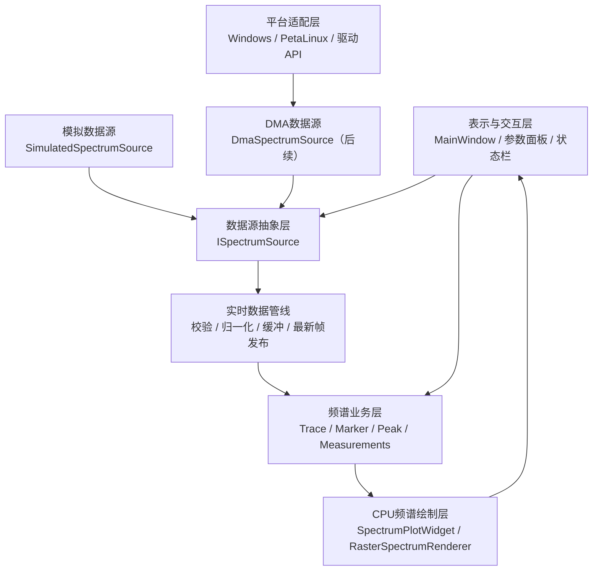
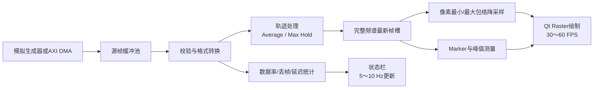
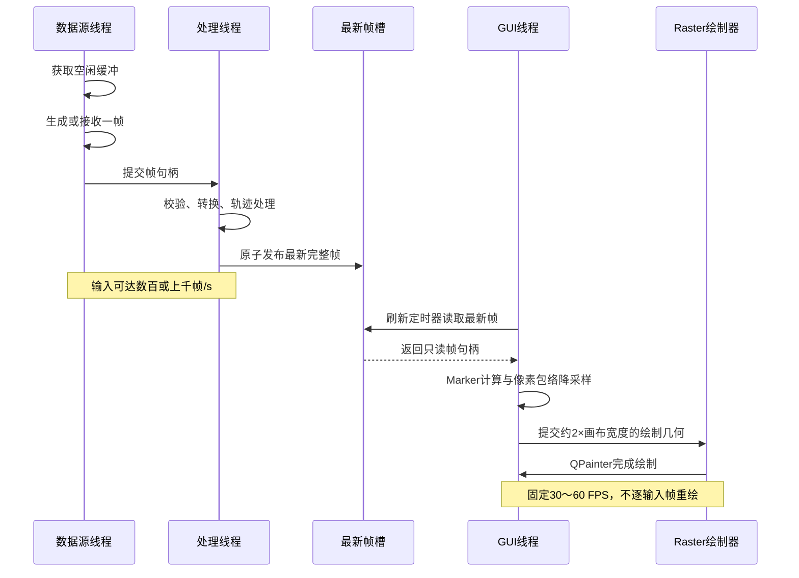
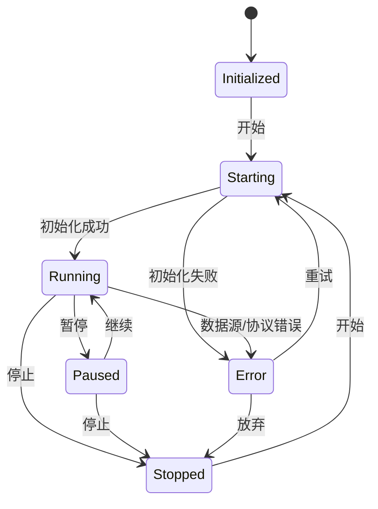

# 基于 RFSoC ZU47DR 的实时频谱分析仪 PS 端软件总体实现架构与设计方案

| 项目 | 内容 |
|---|---|
| 文档版本 | V0.1 |
| 文档状态 | 总体设计基线 |
| 编制日期 | 2026-07-25 |
| 关联需求 | 《实时频谱分析仪软件需求规格说明书》V0.1 |
| 目标硬件 | RFSoC ZU47DR PS 端 |
| 目标系统 | PetaLinux 2023.2，AArch64 Linux |
| PC 开发环境 | Windows + Qt 6.x |
| 目标 Qt | Qt 5.15.4 基线 |
| 图形约束 | 按无可用 GPU 设计，仅使用 CPU Raster 绘制 |
| 一期数据源 | 软件模拟频谱数据 |
| 后续数据源 | AXI DMA 接收 PL 侧 FFT 结果 |

## 1. 文档目的

本文档在软件需求规格说明书基础上，给出实时频谱分析仪 PS 端软件的可实施总体架构、模块划分、线程模型、数据模型、接口约束、CPU 绘制方案、模拟数据方案、DMA 接入策略、性能优化方法、构建部署流程和测试计划。

本文档解决的核心问题是：在目标板没有可用 GPU 加速、PL 逻辑和 DMA 协议尚未完成的条件下，先在 Windows PC 上完成完整软件功能，并保证同一套核心代码能够交叉编译到 PetaLinux 2023.2 中运行；后续接入 DMA 时不重写 GUI、绘图和测量模块。

## 2. 最新架构决策

### 2.1 已确定决策

1. 一期按目标板没有可用 GPU 或没有可用 GPU 驱动设计。
2. 不使用 `QOpenGLWidget`、Qt Quick Scene Graph、EGL、OpenGL ES 或 Mesa 软件 OpenGL绘制频谱。
3. 使用 Qt Widgets 和自定义 `QWidget` 频谱控件。
4. 使用 Qt Raster `QPainter` 完成频谱、网格、坐标和 Marker 绘制。
5. PL 完成 DDC、FFT 等逻辑；PS 不对大带宽原始 ADC 数据执行 FFT。
6. 一期直接生成频域模拟数据，不为了模拟界面而重复执行时域 FFT。
7. 输入数据率与 GUI 刷新率解耦，GUI 不跟随每个输入帧重绘。
8. 内部频点统一转换为 `float32`，默认单位为 dBFS。
9. 同一工程同时支持 Windows Qt 6.x 和目标 Qt 5.15.x。
10. 一期不开发 Linux 内核 AXI DMA 驱动，仅定义并预留用户态数据源接口。

### 2.2 架构优先级

按以下顺序进行设计取舍：

1. 数据正确性和峰值不丢失；
2. GUI 始终可响应；
3. 长时间运行稳定性；
4. 高数据吞吐和低延迟；
5. CPU 与内存效率；
6. 可维护性和可扩展性；
7. 视觉效果。

抗锯齿、渐变、动画等视觉效果不得以明显牺牲吞吐率和界面响应为代价。

## 3. 设计目标和非目标

### 3.1 设计目标

- 支持 1,024～65,536 个频点；
- PC 模拟环境支持 16,384 点、1,000帧/s输入；
- 1920×1080下 GUI 至少30 FPS，目标60 FPS；
- 输入过快时不会形成无界队列；
- 窄带或单频点峰值不会因显示降采样消失；
- GUI线程不等待DMA、文件IO或采集线程；
- 稳态阶段避免逐帧大块内存分配；
- 支持24小时以上连续运行；
- 模拟数据源和DMA数据源可以互换；
- 后续增加瀑布图时复用现有采集和频谱帧管线。

### 3.2 非目标

- PS端原始IQ FFT；
- GPU/OpenGL加速；
- 一期瀑布图；
- 一期多通道并行显示；
- 内核DMA驱动；
- 原始高速数据持续无损存盘；
- 调制识别、解调、EVM和复杂信号分析。

## 4. 总体架构

### 4.1 逻辑分层



### 4.2 运行时数据流



### 4.3 核心思想

数据进入系统后保留两种视图：

- **完整频谱数据**：用于 Marker、峰值搜索、平均、最大保持、CSV 导出及后续测量；
- **显示几何数据**：按屏幕像素宽度压缩后的最小/最大包络，仅用于绘制。

绘图优化不能改变测量数据。65,536个频点在1920像素宽度的画布上没有必要逐点绘制，但必须保留每个像素列覆盖区间的最小值和最大值，避免窄峰被简单抽点丢弃。

## 5. 进程与线程架构

### 5.1 单进程设计

一期采用单进程、多线程结构。原因如下：

- Qt GUI 必须位于主线程；
- 单进程共享频谱缓冲更容易做到少拷贝；
- 一期不需要进程间通信和独立故障域；
- 部署简单，适合嵌入式目标。

未来若文件记录或网络服务变得复杂，可拆分为独立进程，但不作为一期设计内容。

### 5.2 线程划分

| 线程 | 主要对象 | 职责 | 禁止事项 |
|---|---|---|---|
| GUI主线程 | `MainWindow`、`SpectrumPlotWidget` | 事件处理、界面状态、最终绘制 | 阻塞等待数据；大文件写入；DMA读取 |
| 采集线程 | `SimulatedSpectrumSource`或`DmaSpectrumSource` | 生成/接收完整源帧 | 直接访问GUI对象 |
| 处理线程 | `SpectrumPipeline`、`TraceProcessor` | 校验、转换、轨迹处理、发布 | 调用控件绘制接口 |
| 导出线程 | `ExportWorker` | CSV和较大文件写入 | 长时间持有实时帧队列锁 |

在模拟版早期，采集和处理可临时位于同一工作线程；正式性能版本建议分离，使后续DMA阻塞调用不会影响轨迹处理。

### 5.3 时序关系



### 5.4 跨线程通信规则

1. 状态变化、低频统计和错误信息使用 Qt signal/slot。
2. 大容量频谱数据不通过 queued signal 按值传递。
3. 频谱数据通过固定缓冲池中的只读句柄传递。
4. GUI 仅持有绘制期间有效的只读句柄。
5. 工作线程停止时先停止生产，再排空/废弃队列，最后销毁对象。
6. 禁止使用 `QThread::terminate()`。
7. 禁止由工作线程直接修改 QWidget。

## 6. 模块与类设计

### 6.1 应用模块 `app`

主要类：

- `ApplicationBootstrap`：解析命令行、初始化日志、读取配置、创建数据源；
- `RuntimeContext`：保存只读平台能力、程序版本和路径；
- `ShutdownCoordinator`：按顺序停止刷新、数据源、处理和导出线程；
- `CommandLineOptions`：数据源类型、配置路径、全屏、日志级别和QPA参数。

启动顺序：

1. 初始化最小控制台日志；
2. 解析命令行；
3. 加载并校验配置；
4. 创建缓冲池和处理管线；
5. 创建所选数据源；
6. 创建主窗口和绘图资源；
7. 启动工作线程；
8. 显示窗口；
9. 用户点击开始后启动数据流。

### 6.2 数据源模块 `sources`

#### 6.2.1 统一接口

数据源只负责产生源帧，不负责界面绘制、轨迹模式和 Marker。

建议接口：

```cpp
enum class SourceState {
    Initialized,
    Stopped,
    Starting,
    Running,
    Paused,
    Error
};

class ISpectrumSource {
public:
    virtual ~ISpectrumSource() = default;
    virtual void setFrameSink(FrameSink sink) = 0;
    virtual bool start(AcquisitionMode mode = AcquisitionMode::Continuous) = 0;
    virtual void pause() = 0;
    virtual void resume() = 0;
    virtual void stop() = 0;
    virtual SourceState state() const = 0;
    virtual SourceStatistics statistics() const = 0;
};
```

数据源对象创建且具备安全默认配置后处于 `Initialized`；`Starting` 表示正在建立工作线程及底层设备，成功后进入 `Running`。执行过采集并停止后进入 `Stopped`，两者都允许再次启动。未来 DMA 后端的设备打开和缓冲初始化在 `Starting` 阶段完成，失败则进入 `Error`。

真实代码可使用 QObject 提供低频状态信号，但数据帧提交应走 `IFrameSink` 或无大对象复制的队列接口。

#### 6.2.2 模拟数据源

`SimulatedSpectrumSource` 包含：

- `SimulationClock`：按目标帧率产生节拍；
- `NoiseGenerator`：生成噪声底；
- `ToneModel`：生成固定频率或漂移信号；
- `SweepModel`：生成扫频信号；
- `TransientModel`：生成瞬态或突发信号；
- `ScenarioLoader`：读取JSON模拟场景；
- `SimulationStatistics`：统计实际生成帧率和超时。

#### 6.2.3 DMA数据源

`DmaSpectrumSource` 一期只保留接口和桩实现，后续包含：

- `IDmaDevice`：用户态设备访问抽象；
- `DmaBufferLease`：DMA缓冲所有权句柄；
- `SpectrumProtocolParser`：解析帧头和频点载荷；
- `RawToFloatConverter`：定点/整数转内部 `float32`；
- `DmaRecoveryPolicy`：超时、复位和重试策略。

### 6.3 数据管线模块 `pipeline`

`SpectrumPipeline` 执行：

1. 接收完整源帧；
2. 检查帧尺寸、频点数、序号和数值合法性；
3. 必要时执行原始值到 `float32` 的缩放转换；
4. 根据模式执行平均、最大保持或最小保持；
5. 更新接收和处理统计；
6. 发布最新完整频谱帧；
7. 归还不再使用的源缓冲。

管线不得负责：

- 控件创建；
- 坐标文字排版；
- 文件选择对话框；
- PL寄存器的业务控制。

### 6.4 轨迹模块 `domain/trace`

`TraceProcessor` 支持：

- Clear/Write：输出当前帧；
- Average-N：最近 N 帧滑动或指数平均；
- Max Hold：逐频点取历史最大值；
- Min Hold：逐频点取历史最小值；
- Clear History：重置历史。

设计要求：

- 轨迹缓冲与当前FFT点数一致；
- FFT点数、频率范围或幅度单位变化时自动重置；
- 使用连续 `float` 数组；
- 内层循环避免虚函数调用和逐点边界检查；
- 先实现可读的标量版本，板端分析确认瓶颈后再增加 ARM NEON 优化版本；
- NEON版本与标量版本必须逐点对比。

### 6.5 测量模块 `domain/measurement`

主要类：

- `MarkerManager`：Marker生命周期、颜色、选中状态；
- `PeakFinder`：全局峰值、下一个峰值、门限峰值；
- `FrequencyMapper`：频率与频点索引互换；
- `BandPowerCalculator`：后续区间积分功率；
- `MeasurementSnapshot`：一次绘制周期使用的只读测量结果。

Marker和峰值必须在完整频谱上计算。GUI缩放只改变可见范围，不得改变完整数据中的 Marker 数值。

### 6.6 绘图模块 `plot`

主要类：

- `SpectrumPlotWidget`：QWidget、输入事件、刷新调度；
- `RasterSpectrumRenderer`：QPainter绘制；
- `AxisLayoutEngine`：坐标范围、刻度、单位和标签布局；
- `StaticLayerCache`：背景、网格、边框、静态文字缓存；
- `EnvelopeReducer`：完整频谱到像素包络；
- `MarkerOverlayRenderer`：Marker线、标签和峰值提示；
- `PlotTheme`：颜色、线宽、字体和网格样式；
- `RenderStatistics`：绘制耗时、刷新率和跳帧数。

### 6.7 配置模块 `configuration`

- `ConfigurationManager`：读写配置；
- `ConfigurationValidator`：类型和范围校验；
- `ConfigurationMigrator`：配置版本迁移；
- `DefaultConfiguration`：内置安全默认值；
- `ScenarioRepository`：模拟场景列表。

### 6.8 诊断模块 `diagnostics`

- `Logger`：分级、轮转日志；
- `PerformanceCounters`：无锁或低竞争原子计数；
- `LatencyTracker`：采集、处理、显示时间戳；
- `HealthMonitor`：数据中断、队列过载和内存异常趋势；
- `BuildInfo`：Git版本、Qt版本、编译器和平台信息。

## 7. 核心数据模型

### 7.1 频谱帧

建议定义不依赖 Qt 容器的核心结构，便于测试和减少隐式拷贝：

```cpp
enum class AmplitudeUnit : uint8_t {
    Dbfs,
    Dbm,
    Dbc,
    LinearPower
};

struct SpectrumMetadata {
    uint64_t sequence = 0;
    uint64_t timestampNs = 0;
    double centerFrequencyHz = 0.0;
    double spanHz = 0.0;
    uint32_t binCount = 0;
    AmplitudeUnit unit = AmplitudeUnit::Dbfs;
    uint32_t flags = 0;
    uint32_t configurationEpoch = 0;
};

struct SpectrumFrameView {
    SpectrumMetadata metadata;
    const float* bins = nullptr;
    std::size_t size = 0;
};
```

`configurationEpoch` 用于防止参数切换期间把旧FFT尺寸或旧频率范围的帧绘制到新坐标上。

### 7.2 内存布局

- 频点使用连续 `float32` 数组；
- 数组起始地址建议至少16或32字节对齐，便于NEON和缓存访问；
- 元数据与大数组分开，避免高频统计修改造成频点缓存行失效；
- 不使用 `std::vector<std::pair<double,double>>` 保存频率和幅度；频率由索引计算；
- 频点原始数据使用 `float`，坐标计算只在必要处使用 `double`；
- 绘制坐标使用整数 `QPoint`/`QLine`，避免无意义的高精度图形运算。

### 7.3 缓冲池

建议初始配置：

| 缓冲类型 | 建议数量 | 单缓冲最大尺寸 | 用途 |
|---|---:|---:|---|
| 源帧缓冲 | 4～8 | 65,536 × 原始频点字节数 | 模拟/DMA写入 |
| 归一化帧缓冲 | 3～4 | 256 KiB | `float32`完整频谱 |
| 轨迹缓冲 | 每启用轨迹1个 | 256 KiB | Average/Max/Min |
| 包络最小值 | 1 | 画布宽度 × 4 B | 显示降采样 |
| 包络最大值 | 1 | 画布宽度 × 4 B | 显示降采样 |
| 绘制线数组 | 1～2 | 画布宽度 × `sizeof(QLine)` | Raster绘制 |

即使按8个最大 `float32` 帧计算，频谱缓冲也约为2 MiB，远低于无界队列的风险。

## 8. 实时队列与过载策略

### 8.1 队列类型

采集线程到处理线程采用固定容量 SPSC 环形队列。处理线程到GUI采用单元素“最新帧槽”或三缓冲发布结构。

不推荐：

- 无界 `QQueue`；
- 每帧 `new QVector<float>`；
- 在GUI事件队列中投递1,000个大对象事件；
- GUI和DMA线程共享一把长时间互斥锁。

### 8.2 两种运行模式

#### 实时显示优先模式（默认）

- 队列满时丢弃最旧待处理帧；
- GUI只显示最新帧；
- 端到端延迟最低；
- 适合实时观察。

#### 测量完整性优先模式

- Average/Max Hold等需要处理每帧时启用；
- 处理能力不足时请求模拟源降速，真实DMA则报告过载；
- 不允许通过无界排队维持“表面不丢帧”；
- 若硬件不能降速，明确记录丢帧并标记测量不完整。

### 8.3 帧发布伪代码

```text
采集线程：
    buffer = pool.acquire()
    source.fill(buffer)
    if queue.full():
        queue.dropOldestAndRelease()
        counters.pipelineDrops++
    queue.push(buffer)

处理线程：
    while queue.tryPop(buffer):
        validate(buffer)
        normalized = convertOrReuse(buffer)
        trace = traceProcessor.process(normalized)
        latestSlot.publish(trace)

GUI刷新：
    if latestSlot.sequence != lastPaintedSequence:
        frame = latestSlot.acquireReadOnly()
        reducer.reduce(frame, plotWidth)
        update()
```

## 9. 模拟频谱数据方案

### 9.1 为什么直接生成频域数据

一期目标是验证上位机而非验证FFT算法。直接生成频域数据可以：

- 精确控制频点数和帧率；
- 模拟PL最终输出格式；
- 避免PC端FFT消耗掩盖上位机性能；
- 构造可重复的峰值和边界测试；
- 快速产生高帧率压力数据。

### 9.2 生成流程

1. 根据噪声底生成每个频点的线性噪声功率；
2. 叠加固定信号、扫频信号和瞬态信号的线性功率；
3. 转换为 dBFS；
4. 限制在模拟动态范围内；
5. 填入帧序号、时间戳和频率元数据；
6. 发布给与DMA相同的数据管线。

### 9.3 信号模型

| 模型 | 参数 | 建议实现 |
|---|---|---|
| 白噪声 | 噪声底、方差、随机种子 | 正态或指数功率分布 |
| 单音 | 频率、幅度、宽度 | 主峰加可配置旁瓣模板 |
| 多音 | 多组单音参数 | 在线性功率域叠加 |
| 扫频 | 起止频率、周期、方向 | 根据时间计算当前中心频率 |
| 瞬态 | 概率、持续帧数、幅度 | 状态机控制出现和消失 |
| 漂移信号 | 漂移速度、范围 | 缓慢更新频率或幅度 |

### 9.4 性能优化

- 固定信号的频谱模板预计算；
- 只有频率或幅度变化时重建对应模板；
- 使用固定种子时允许预生成一组噪声帧循环播放；
- 压测模式允许从预生成帧池高速发布；
- 模拟节拍使用单独时钟，不依赖GUI定时器；
- 1,000帧/s模式采用高精度等待加时间补偿，不要求每1 ms绝对精确唤醒；统计以实际帧率为准。

## 10. CPU Raster频谱绘制详细方案

### 10.1 绘制对象

绘图区分为三层：

1. **静态层**：背景、边框、主/次网格、固定坐标标签；
2. **动态频谱层**：实时曲线、Max Hold、Average等轨迹；
3. **覆盖层**：Marker、峰值标签、暂停提示、告警。

静态层缓存为 `QImage::Format_ARGB32_Premultiplied` 或经板端实测更优的原生格式。只有以下事件使静态层失效：

- 窗口尺寸变化；
- 坐标范围变化；
- 字体/DPI变化；
- 主题或网格配置变化；
- 单位变化。

### 10.2 像素包络降采样

设完整频点数为 `N`，绘图区宽度为 `W`。对每个横向像素列 `x`：

```text
begin = floor(x × N / W)
end   = floor((x + 1) × N / W)
end   = max(end, begin + 1)

minValue[x] = min(bins[begin ... end-1])
maxValue[x] = max(bins[begin ... end-1])
```

随后把最小值和最大值转换为屏幕Y坐标，并生成一条竖直 `QLine`。必要时再用代表值连接相邻像素列，使曲线连续。

复杂度：

- 扫描频点：O(N)；
- 绘制端点：O(W)；
- 额外内存：O(W)。

该算法比“每隔K点取一个点”更适合频谱，因为后者可能完全跳过窄带峰值。

### 10.3 Y坐标映射

```text
normalized = (referenceLevel - value) / (referenceLevel - bottomLevel)
y = plotTop + clamp(normalized, 0, 1) × plotHeight
```

映射前检查 NaN/Inf。超出显示范围的值裁剪到边界，但完整测量值不被修改。

### 10.4 QPainter优化规则

1. 默认关闭曲线抗锯齿；允许用户开启，但不作为性能验收配置。
2. 优先使用整数 `QLine`/`QPoint`，避免每帧创建大量 `QPainterPath` 节点。
3. `QVector<QLine>` 或等价连续数组启动时 `reserve(plotWidth)`，尺寸变化时再调整。
4. 使用一次 `drawLines()` 或少量批量调用，避免逐像素多次进入QPainter API。
5. 画笔、字体、颜色在绘制开始前设置，内层循环不反复切换状态。
6. Marker文字背景和标签尺寸缓存。
7. 使用 `update()` 合并重绘请求，不使用同步 `repaint()`。
8. 只刷新频谱画布，不因频谱更新重绘右侧参数面板。
9. 状态栏以5～10 Hz更新，不以60 Hz刷新全部文本。
10. 不在 `paintEvent()` 内访问文件、日志、DMA或等待互斥锁。

### 10.5 帧率调度

- 默认目标刷新率：60 FPS；
- 最低验收刷新率：30 FPS；
- 使用 `Qt::PreciseTimer` 或等价机制触发刷新；
- 仅当存在新帧或覆盖层变化时调用 `update()`；
- 若连续窗口内95百分位绘制耗时超过帧预算的80%，自动降至30 FPS并记录告警；
- 性能恢复后是否自动回升可配置，默认避免频繁来回切换；
- 暂停状态只在交互变化时重绘。

### 10.6 NEON优化策略

ARM NEON只作为分析确认后的二级优化：

- 原始值到 `float32` 缩放；
- Average/Max Hold逐点运算；
- 大块频点的min/max归约；
- NaN/Inf批量检测。

优化步骤：

1. 先用标量实现保证正确性；
2. 在目标板采集模块耗时；
3. 只有占总CPU时间显著比例的循环才使用NEON；
4. 保留标量回退路径；
5. 使用相同测试向量验证误差和边界情况。

## 11. GUI总体设计

### 11.1 1920×1080布局

```text
┌────────────────────────────────────────────────────────────────────┐
│ 菜单：文件 / 显示 / 测量 / 数据源 / 工具 / 帮助                    │
├────────────────────────────────────────────────────────────────────┤
│ 快捷栏：开始 暂停 单次 峰值 最大保持 平均 全屏 截图                 │
├───────────────────────────────────────────────────┬────────────────┤
│                                                   │ 数据源         │
│                                                   │ Center/Span    │
│                  实时频谱画布                     │ 幅度设置       │
│                                                   │ 轨迹设置       │
│                                                   │ Marker         │
│                                                   │ 模拟场景       │
├───────────────────────────────────────────────────┴────────────────┤
│ Running | In 1000 FPS | View 60 FPS | 65.5 MB/s | Drop 0 | 80 ms  │
└────────────────────────────────────────────────────────────────────┘
```

### 11.2 主要交互

- Center/Span与Start/Stop联动；
- 鼠标滚轮围绕指针频率缩放；
- 左键拖动平移；
- 双击恢复完整范围；
- 单击曲线设置活动Marker；
- Peak Search定位当前最大峰；
- 暂停保留最后一帧；
- 单次采集只更新一帧后暂停；
- 全屏隐藏非必要边框但保留关键控制。

### 11.3 UI状态模型



按钮可用状态由状态机统一决定，不在多个槽函数中分别维护。

## 12. 坐标、Marker与测量设计

### 12.1 频率映射

```text
startHz = centerHz - spanHz / 2
stopHz  = centerHz + spanHz / 2
binWidthHz = spanHz / binCount
frequency(i) = startHz + i × binWidthHz
```

真实PL协议若定义FFT终点包含关系不同，由 `FrequencyMapper` 配置策略处理。

### 12.2 坐标刻度

- 主刻度优先选择1、2、5 × 10ⁿ；
- 频率根据量级显示Hz、kHz、MHz、GHz；
- 避免相邻标签重叠；
- 标签小数位由刻度间隔决定；
- 使用整数Hz或 `double` 保存内部频率，不以格式化文本反算数值。

### 12.3 峰值搜索

基础峰值搜索：

1. 根据可见范围或完整范围确定索引区间；
2. 扫描完整轨迹数据；
3. 忽略无效值；
4. 找到最大值索引；
5. 通过插值提高显示频率估计属于后续可选功能；
6. 返回频点原值和频率，不读取降采样数组。

### 12.4 Marker快照

GUI每次绘制前生成一次不可变 `MeasurementSnapshot`，保证同一帧中的Marker线、标签和状态栏读数来自相同频谱序号。

## 13. 配置、日志与导出

### 13.1 配置

建议采用版本化JSON：

```json
{
  "schemaVersion": 4,
  "source": {
    "type": "simulated",
    "binCount": 16384,
    "frameRate": 1000,
    "centerFrequencyHz": 1000000000,
    "spanHz": 200000000
  },
  "display": {
    "refreshFps": 60,
    "referenceLevel": 0,
    "bottomLevel": -140,
    "antiAliasing": false,
    "traceColorPreset": 0,
    "traceLineWidth": 1,
    "gridVisible": true,
    "theme": "dark"
  },
  "trace": {
    "mode": "clearWrite",
    "averageCount": 16
  }
}
```

应用设置使用强制原子同步的 `QSettings`，独立模拟场景和导出使用 `QSaveFile`。加载失败时记录 warning 并使用安全默认值。

### 13.2 日志

- 正常运行不记录逐帧日志；
- 高频错误使用限流和汇总；
- 日志轮转，限制文件尺寸和数量；
- 性能统计按1秒或更低频率写入；
- 记录数据源状态、参数变化、配置版本、异常和恢复；
- Debug日志可记录短时间帧序号，但默认关闭。

### 13.3 CSV导出

导出对象为用户触发时的完整只读帧快照。CSV包含：

- 序号、时间戳；
- Center、Span、Start、Stop；
- 频点数和单位；
- `bin_index, frequency_hz, amplitude`。

导出线程持有帧句柄或复制单帧后立即释放实时缓冲，不得长期占用缓冲池。

## 14. AXI DMA后续实现方案

### 14.1 接入边界

上位机依赖驱动提供：

- 打开/关闭设备；
- 申请或映射DMA缓冲；
- 等待完整S2MM帧；
- 获得有效长度和错误状态；
- 缓冲所有权交接；
- 超时、停止和复位接口。

上位机不直接在用户态维护物理地址或自行执行缓存同步。

### 14.2 适配结构

```text
Linux驱动API
    ↓
IDmaDevice
    ↓
DmaSpectrumSource
    ↓
SpectrumProtocolParser
    ↓
RawToFloatConverter
    ↓
SpectrumPipeline
```

### 14.3 协议解析要求

- 验证Magic和协议版本；
- 验证载荷长度不超过DMA有效长度；
- 验证频点数在允许范围；
- 检查字节序、符号和定点小数位；
- 检查帧序号跳变；
- 检查中心频率和Span是否合法；
- 解析失败时丢弃整帧，不使用半帧绘制；
- 解析器按协议版本注册，避免把版本判断散布到GUI。

### 14.4 少拷贝策略

优先级：

1. DMA载荷已经是`float32`且排列一致：尽量以只读视图直接处理；
2. DMA为16/32位定点：转换到预分配的归一化缓冲；
3. 轨迹模式需要历史：写入独立轨迹缓冲；
4. GUI只读取处理后的完整帧，不直接读取仍可能被DMA复用的内存。

“零拷贝”不能以破坏DMA缓冲所有权和缓存一致性为代价。

## 15. 性能模型

### 15.1 数据吞吐

内部 `float32` 频谱数据：

| 频点数 | 单帧 | 200帧/s | 1,000帧/s |
|---:|---:|---:|---:|
| 4,096 | 16 KiB | 3.28 MB/s | 16.38 MB/s |
| 16,384 | 64 KiB | 13.11 MB/s | 65.54 MB/s |
| 32,768 | 128 KiB | 26.21 MB/s | 131.07 MB/s |
| 65,536 | 256 KiB | 52.43 MB/s | 262.14 MB/s |

65,536点、1,000帧/s为极限压力场景，不作为PL参数未知阶段的硬性板端承诺。

### 15.2 60 FPS帧预算

单帧显示预算约16.67 ms。初始目标分配：

| 操作 | 目标95百分位 |
|---|---:|
| 获取最新帧句柄 | < 0.1 ms |
| Marker/峰值更新 | < 1.0 ms |
| 65,536点包络降采样 | < 2.0 ms |
| 构造绘制线数组 | < 1.0 ms |
| QPainter动态绘制 | < 6.0 ms |
| Qt合成和其他GUI工作 | < 4.0 ms |
| 余量 | > 2.5 ms |

这些是优化目标而非未经测量的保证。必须在Windows和目标板分别记录平均、95百分位和最大耗时。

### 15.3 性能退化顺序

负载过高时依次采取：

1. 停止非必要状态文本高频刷新；
2. 关闭抗锯齿和装饰效果；
3. 确认只绘制最新帧；
4. 将GUI刷新率从60降至30 FPS；
5. 减少同时显示的辅助轨迹；
6. 对热点循环增加NEON；
7. 与PL协商降低帧率或频点数。

不得首先采用降低测量正确性或简单漏掉窄峰的抽点方式。

### 15.4 性能计数器

必须统计：

- 源产生/接收帧率；
- 接收字节率；
- 源错误帧；
- 处理队列丢帧；
- GUI跳过帧；
- 实际绘制FPS；
- 处理耗时；
- 包络降采样耗时；
- `paintEvent`耗时；
- 最新帧年龄和端到端延迟；
- 缓冲池最低空闲数。

源/传输、无效输入、处理拒绝和 GUI 跳过必须使用不重叠的分类。处理流水线为每个成功发布的帧分配独立单调发布序号，GUI 依据该序号统计已发布但未显示的帧，不能直接用 PL/数据源序号差值推断 GUI 丢帧。端到端可见延迟在对应发布帧的 `paintEvent` 完成后采样，使用固定 256 样本窗口计算 P95。

## 16. Windows、Qt5与PetaLinux兼容方案

### 16.1 Qt版本策略

- Windows当前使用Qt 6.x开发；
- 尽早增加Windows Qt 5.15.x构建；
- 目标端使用PetaLinux 2023.2 Qt 5.15.4基线；
- Qt差异封装在 `compatibility/QtCompat.*`；
- 业务和算法模块尽量使用标准C++17；
- 绘图使用Qt5和Qt6均存在的 QWidget/QPainter API。

### 16.2 CMake策略

```cmake
find_package(QT NAMES Qt6 Qt5 REQUIRED COMPONENTS Core Gui Widgets Test)
find_package(Qt${QT_VERSION_MAJOR} REQUIRED COMPONENTS Core Gui Widgets)

target_link_libraries(rtsa_app PRIVATE
    Qt${QT_VERSION_MAJOR}::Core
    Qt${QT_VERSION_MAJOR}::Gui
    Qt${QT_VERSION_MAJOR}::Widgets
)
```

算法核心应形成不依赖Widgets的静态库，便于单元测试和性能测试。

### 16.3 构建矩阵

| 配置 | 平台 | Qt | 数据源 | 用途 |
|---|---|---|---|---|
| Win-Qt6-Debug | Windows x64 | Qt 6.x | Simulated | 日常开发 |
| Win-Qt6-Release | Windows x64 | Qt 6.x | Simulated | PC性能测试 |
| Win-Qt5-Release | Windows x64 | Qt 5.15.x | Simulated | 兼容验证 |
| Linux-Native | Linux x64 | 可选Qt5 | Simulated | 构建流程验证 |
| PetaLinux-AArch64 | ZU47DR PS | Qt 5.15.4 | Simulated/DMA | 目标部署 |

### 16.4 交叉编译流程

```text
Windows完成开发与提交
        ↓
Linux构建主机获取同一源码
        ↓
PetaLinux 2023.2生成包含Qt5的SDK
        ↓
source <sdk>/environment-setup-*
        ↓
CMake使用SDK编译器与sysroot配置
        ↓
生成AArch64可执行文件
        ↓
复制到目标rootfs或制作PetaLinux应用配方
        ↓
目标板模拟模式验证
```

不建议把正式PetaLinux构建依赖于Windows原生环境。Linux构建主机使用PetaLinux官方支持的发行版版本。

## 17. 目标显示后端与部署

### 17.1 QPA选择

按无GPU方案优先级：

1. `linuxfb`：直接使用Linux framebuffer，部署依赖少；
2. `xcb`：目标系统已有X11时使用；
3. 其他厂商提供的纯Raster显示后端。

不使用依赖EGL/OpenGL的 `eglfs` 作为一期前提。

### 17.2 启动参数示例

```bash
export QT_QPA_PLATFORM=linuxfb
export QT_QPA_FONTDIR=/usr/share/fonts
./rtsa_app --source simulated --fullscreen
```

最终环境变量以目标BSP实际显示驱动为准。

### 17.3 rootfs依赖

至少确认：

- Qt Core、Gui、Widgets；
- 对应QPA平台插件；
- 字体和字体配置；
- 输入设备支持；
- C++运行库；
- 日志和配置目录写权限；
- 后续DMA字符设备权限。

部署前使用目标工具链的依赖检查工具确认无缺失动态库。

## 18. 建议源码目录

```text
RTSA/
├─ CMakeLists.txt
├─ cmake/
│  ├─ Toolchains/
│  └─ BuildOptions.cmake
├─ config/
│  ├─ default.json
│  └─ scenarios/
├─ docs/
├─ resources/
│  ├─ icons/
│  ├─ styles/
│  └─ fonts/
├─ src/
│  ├─ app/
│  ├─ core/
│  │  ├─ SpectrumFrame.h
│  │  ├─ BufferPool.*
│  │  └─ SpscQueue.*
│  ├─ sources/
│  │  ├─ ISpectrumSource.h
│  │  ├─ simulated/
│  │  └─ dma/
│  ├─ pipeline/
│  ├─ domain/
│  │  ├─ trace/
│  │  └─ measurement/
│  ├─ plot/
│  │  ├─ SpectrumPlotWidget.*
│  │  ├─ RasterSpectrumRenderer.*
│  │  ├─ EnvelopeReducer.*
│  │  └─ AxisLayoutEngine.*
│  ├─ ui/
│  ├─ configuration/
│  ├─ diagnostics/
│  ├─ compatibility/
│  └─ platform/
│     ├─ windows/
│     └─ linux/
├─ tests/
│  ├─ unit/
│  ├─ integration/
│  ├─ performance/
│  └─ testdata/
└─ tools/
```

## 19. 测试架构

### 19.1 单元测试

| 模块 | 关键测试 |
|---|---|
| `EnvelopeReducer` | 单点尖峰、边界频点、N<W、N>W、NaN/Inf |
| `TraceProcessor` | Average、Max/Min Hold、尺寸切换、重置 |
| `FrequencyMapper` | 索引/频率互换、Start/Stop边界 |
| `PeakFinder` | 多峰、同高峰、门限、无效数据 |
| `BufferPool` | 枯竭、归还、并发、停止流程 |
| `SpscQueue` | 满队列、丢弃策略、序号顺序 |
| `Configuration` | 默认值、非法值、版本迁移、损坏文件 |
| `Simulation` | 固定种子可重复、信号位置和幅度 |

### 19.2 性能基准

建立无GUI和有GUI两类基准：

- 频谱生成吞吐；
- 原始值转换吞吐；
- Average/Max Hold吞吐；
- 65,536点包络降采样耗时；
- 1920像素 `drawLines()`耗时；
- 不同字体/网格缓存策略；
- 30和60 FPS下CPU占用；
- 1,000帧/s输入下GUI响应和队列深度。

### 19.3 长稳测试

持续24小时记录：

- RSS内存；
- CPU占用；
- 输入/显示FPS；
- 丢帧和错误；
- 最大绘制耗时；
- 日志增长；
- 缓冲池空闲数量；
- GUI心跳。

验收要求为无崩溃、无死锁、无持续内存增长趋势。

### 19.4 目标板专项测试

- `linuxfb`或实际Raster QPA启动；
- 未安装OpenGL库时仍可运行；
- 1920×1080布局和字体；
- CPU频率变化对帧率的影响；
- 长时间Raster绘制是否撕裂；
- 触摸/鼠标输入；
- 目标存储的配置和日志可靠性；
- 温度和系统负载下性能。

## 20. 实施阶段

### 阶段A：基础工程

- CMake Qt5/Qt6双版本骨架；
- 核心数据模型；
- 日志、配置和Qt Test；
- 主窗口空布局。

完成标志：Windows Qt6和Qt5均能启动空程序。

### 阶段B：模拟数据管线

- 缓冲池和SPSC队列；
- 模拟源、帧率控制和场景配置；
- 最新帧发布及统计。

完成标志：无GUI性能程序可稳定产生目标数据率。

### 阶段C：CPU频谱绘制

- Raster画布；
- 坐标、网格和静态缓存；
- 包络降采样；
- 固定30/60 FPS调度。

完成标志：65,536点单点尖峰可见，GUI持续响应。

### 阶段D：仪器功能

- Center/Span和幅度控制；
- Marker、Peak Search；
- Average、Max Hold；
- 暂停、单次和全屏。

### 阶段E：导出与稳定性

- PNG、CSV和配置；
- 错误恢复；
- 性能分析和24小时测试；
- 按测量结果增加NEON优化。

### 阶段F：PetaLinux部署

- 生成Qt5 SDK；
- AArch64交叉编译；
- Raster QPA板端运行；
- CPU、内存和帧率优化。

### 阶段G：DMA联调

- 获取正式协议和驱动API；
- 实现DMA数据源；
- 完成吞吐、序号、字节序、标定和长稳测试。

## 21. 后续瀑布图扩展方案

一期不实现瀑布图，但架构需满足：

- 瀑布图订阅处理后的完整频谱帧；
- 使用独立固定容量历史环形缓冲；
- 历史深度受内存预算限制；
- 瀑布图刷新率可以低于输入帧率；
- CPU模式下将每帧幅度映射为一行索引色或RGB像素；
- 使用滚动环形图像而非每帧整体移动大图；
- 瀑布图关闭时不分配其大容量历史内存；
- 不修改现有 `ISpectrumSource` 接口。

## 22. 风险与技术对策

| 风险 | 表现 | 对策 |
|---|---|---|
| 无GPU导致Raster占用高 | 帧率下降 | 包络降采样、静态缓存、批量drawLines、30/60 FPS分离 |
| Qt6先开发、Qt5后移植 | API不兼容 | Qt兼容层、持续Qt5构建、不使用Qt6专属控件 |
| 输入1,000帧/s淹没GUI | 事件队列增长 | 数据不走GUI事件队列、最新帧槽、固定刷新调度 |
| Max Hold需要每帧处理 | 处理负载高 | 测量完整性模式、NEON优化、明确过载状态 |
| 简单抽点漏掉窄峰 | 显示错误 | 每像素最小/最大包络算法 |
| 大量帧内存复制 | CPU和带宽浪费 | 缓冲池、只读句柄、连续数组、少拷贝转换 |
| DMA协议晚确定 | 接入返工 | 数据源和解析器独立、统一内部帧 |
| linuxfb刷新撕裂 | 视觉质量差 | 验证双缓冲/QPA能力、限制刷新率、优化更新区域 |
| 日志写满存储 | 系统异常 | 日志轮转、限流、容量告警 |
| 参数切换读到旧帧 | 坐标与数据错配 | `configurationEpoch`和帧尺寸校验 |

## 23. 待确认事项

1. 目标板显示接口和Linux framebuffer设备；
2. 最终QPA平台是`linuxfb`还是`xcb`；
3. 屏幕实际分辨率、刷新率和触摸设备；
4. PS内存容量和可用CPU频率；
5. PL最终FFT点数、帧率和频点位宽；
6. FFT Shift、字节序和标度公式；
7. DMA Simple或Scatter-Gather模式；
8. Linux DMA驱动用户态API；
9. dBFS到dBm的标定关系；
10. Max Hold/Average是否要求逐个输入帧完整处理。

这些信息未确定前，均通过配置、抽象接口和版本化协议处理，不固化猜测值。

## 24. 总结

本方案以“PL完成频谱计算、PS专注高速接收和CPU显示”为边界，通过数据源抽象、固定缓冲池、SPSC队列、最新帧发布、输入/显示解耦和峰值保真包络降采样，在没有GPU的条件下实现高吞吐、低延迟和长期稳定的频谱上位机。

一期实现的关键不是让GUI绘制每一个输入帧，而是保证：所有被处理的完整频谱数据正确、测量不依赖降采样、屏幕始终呈现最新有效状态、过载行为明确可见、后续DMA接入不破坏现有软件结构。
